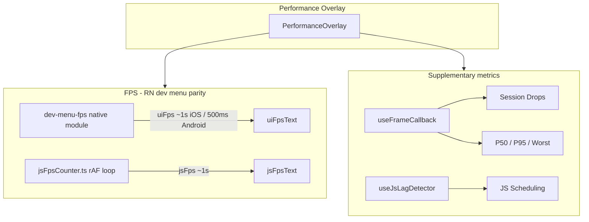

# Performance Documentation

Dev-only overlay for comparing feed and chat performance. FPS values align with React Native's Perf Monitor; supplementary metrics (P50/P95, session drops) go beyond the compact dev-menu bar.

## Architecture



Instrumentation runs **only when the overlay is visible** (`usePerformanceInstrumentation`).

---

## Metric Summary

| Metric | Source | Thread | Update rate | RN Perf Monitor |
|--------|--------|--------|-------------|-----------------|
| UI FPS | `dev-menu-fps` native module | Main / UI | ~1s iOS, ~500ms Android | Matches |
| JS FPS | `jsFpsCounter.ts` (rAF tick count) | JS | ~1s | Matches behavior |
| Session Drops | Reanimated `useFrameCallback` | UI worklet | 1 Hz → Zustand | Not shown in compact bar |
| P50 / P95 / Worst | Last 60 frame times | UI → JS | 1 Hz | Not shown in compact bar |
| JS Scheduling | setInterval → rAF drift | JS | ~10 Hz | Not shown in compact bar |

Both FPS metrics **default to 60** until the first measurement window completes.

---

## UI FPS (native)

Local Expo module: [`modules/dev-menu-fps/`](modules/dev-menu-fps/)

Ports `RCTFPSGraph` tick counting: `round(frameCount / elapsedSeconds)` over a completed window.

| Platform | Mechanism | Window |
|----------|-----------|--------|
| iOS | `CADisplayLink` on main run loop | ≥ 1 second |
| Android | `Choreographer.FrameCallback` | 500 ms reset (FpsView pattern) |

Native events emit `{ uiFps }` only. Requires a **dev build** (`npx expo run:ios` / `run:android`). Expo Go shows `—` for FPS.

---

## JS FPS (JavaScript)

[`src/features/performance/services/jsFpsCounter.ts`](src/features/performance/services/jsFpsCounter.ts)

Same tick-count formula as `RCTFPSGraph`, implemented with `requestAnimationFrame` on the RN JS event loop.

Native JS `CADisplayLink` is **not** used — on New Architecture (`newArchEnabled: true`) the JS runtime executor does not pump an `NSRunLoop`, so native JS display links never fire.

Wired in [`useDevMenuFps.ts`](src/features/performance/hooks/useDevMenuFps.ts):

1. Register native listener → update `uiFpsText`
2. Start rAF counter → update `jsFpsText`
3. Listener registered **before** `startMonitoring()`

---

## Supplementary metrics

### Session drops

Counted when `frameTime > 22.2 ms` (~45 fps budget). Cumulative since overlay open; synced to Zustand at 1 Hz.

### P50 / P95 / Worst

Rolling buffer of last **60** UI frame times (~1 s at 60 Hz). Percentiles via quickselect on the JS thread.

### JS scheduling

Every 100 ms: `setInterval` schedules `requestAnimationFrame`; drift **> 50 ms** → **JS Busy** (scheduling delay heuristic, not a profiler).

### Warmup

First **500 ms** after overlay open excluded from drop counting and percentile samples.

---

## Key files

| File | Role |
|------|------|
| [`usePerformanceInstrumentation.ts`](src/features/performance/hooks/usePerformanceInstrumentation.ts) | Orchestrates all hooks when overlay visible |
| [`useDevMenuFps.ts`](src/features/performance/hooks/useDevMenuFps.ts) | Native UI FPS + JS rAF FPS |
| [`useNativeFrameMetrics.ts`](src/features/performance/hooks/useNativeFrameMetrics.ts) | Drops + percentiles via Reanimated frame callback |
| [`useJsLagDetector.ts`](src/features/performance/hooks/useJsLagDetector.ts) | JS scheduling heuristic |
| [`PerformanceOverlay.tsx`](src/components/organisms/performance/PerformanceOverlay/PerformanceOverlay.tsx) | Draggable overlay UI |
| [`frameBuffer.worklet.ts`](src/features/performance/services/frameBuffer.worklet.ts) | UI-thread frame time ring buffer |
| [`frameStatsCalculator.ts`](src/features/performance/services/frameStatsCalculator.ts) | P50/P95 quickselect |

---

## Validation checklist

| Scenario | Expected |
|----------|----------|
| Expo Go / web | FPS shows `—` |
| Dev build idle | UI/JS start at 60, update within ~1 s; within ±1–2 of RN Perf Monitor |
| ProMotion (120 Hz) | UI FPS ~120 when dev menu also shows ~120 |
| Fast scroll | UI FPS dips, P95 rises, session drops increment |
| Travel Crew AI streaming | JS FPS dips on load |

---

## Tradeoffs

**Split UI (native) / JS (rAF) FPS** — UI uses native CADisplayLink/Choreographer for dev-menu parity; JS uses rAF because native JS CADisplayLink fails on New Architecture. JS FPS tracks RN Perf Monitor behavior in practice.

**Supplementary Reanimated metrics** — P50/P95/drops add diagnostics beyond the dev-menu bar at small UI-thread cost while the overlay is open.

**Observer effect** — The overlay itself adds overhead. Use metrics for before/after comparisons in dev, not as production baselines.

---

## Setup

```bash
npx expo prebuild   # if native project not generated
npx expo run:ios    # or run:android
```

Toggle overlay via **Hide Perf** / dev overlay control in the app root layout.
